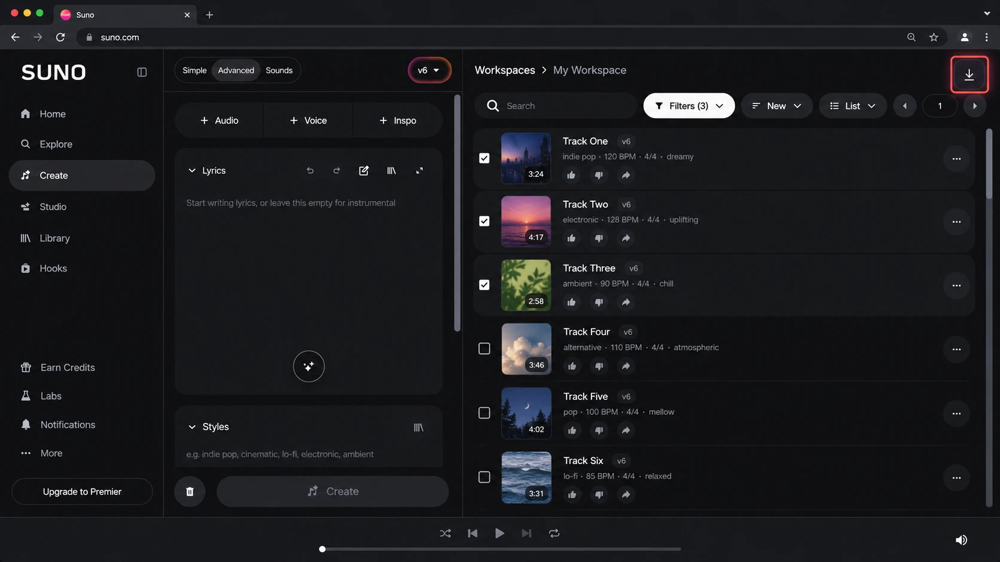
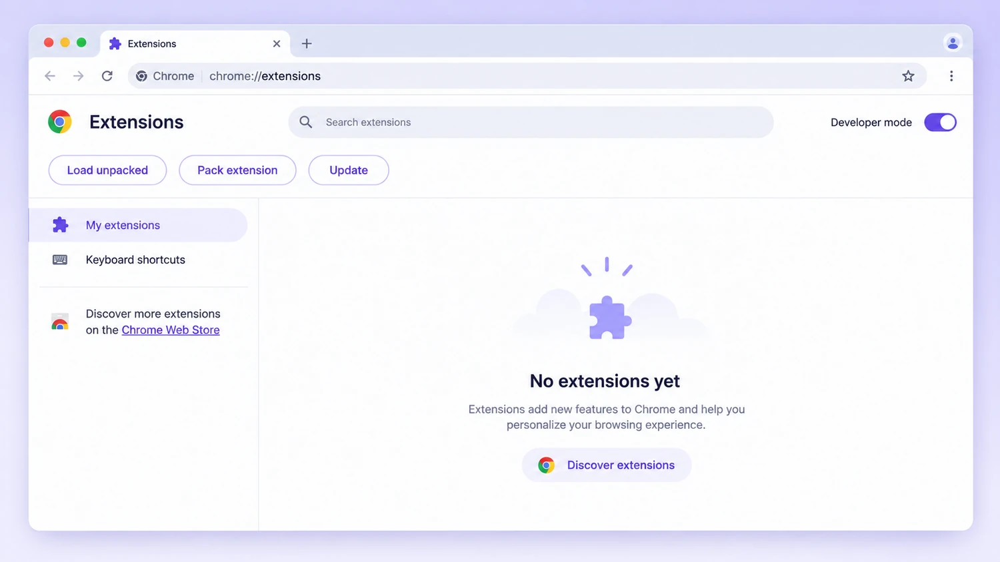
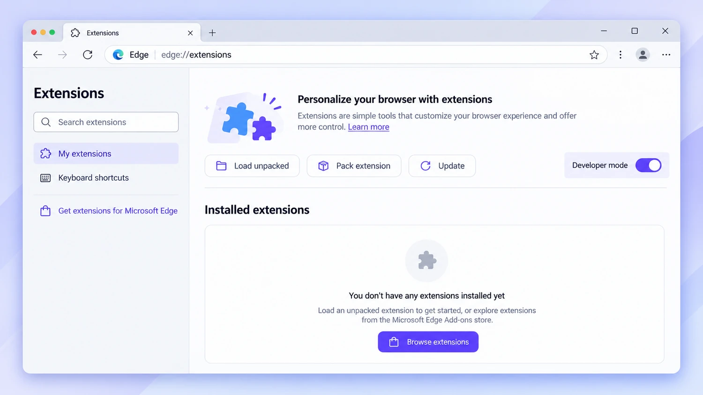
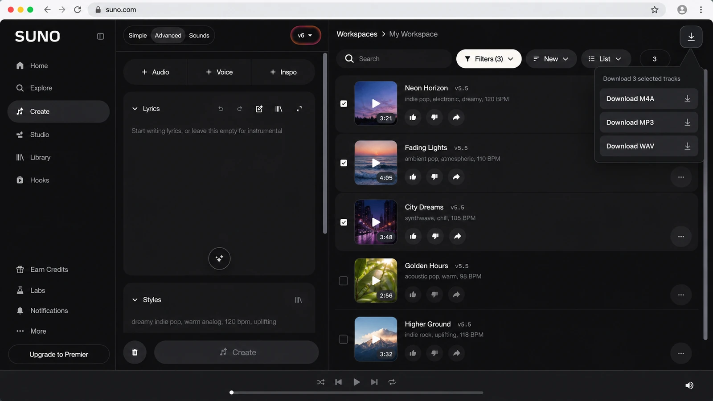

<p align="center">
  <a href="https://sunobatch.com/">
    
  </a>
</p>

<h1 align="center">SunoBatch</h1>

<p align="center">
  <strong>Batch-download Suno tracks without tracking everything by hand.</strong>
</p>

<p align="center">
  Select up to 20 tracks, choose M4A / MP3 / WAV, follow task status, and keep your Suno sign-in where it belongs — on Suno.
</p>

<p align="center">
  <a href="https://sunobatch.com/"><strong>🚀 Get Started Free</strong></a>
  ·
  <a href="https://sunobatch.com/extension"><strong>⬇️ Download Extension</strong></a>
  ·
  <a href="https://sunobatch.com/#pricing"><strong>💳 View Pricing</strong></a>
</p>

<p align="center">
  
  
  
  
</p>

---

## Stop downloading Suno tracks one by one

If you create a lot of music with Suno, the repetitive part adds up quickly:

- selecting tracks,
- choosing an export format,
- keeping track of what finished,
- checking daily limits,
- and remembering what still needs attention.

**SunoBatch turns that into one clear workflow.**

Use the browser extension on Suno, select the tracks you want, choose **M4A, MP3, or WAV**, and track your task from your SunoBatch workspace.

<p align="center">
  <a href="https://sunobatch.com/">
    
  </a>
</p>

> **Ready to try it?**  
> Create your account at **[sunobatch.com](https://sunobatch.com/)** and start with the Free plan.

---

## Why creators use SunoBatch

### ⚡ Process a whole batch
Select **1–20 tracks** instead of handling every export as a separate manual chore.

### 🎧 Choose the format you need
Create download tasks for:

- **M4A**
- **MP3**
- **WAV**

### 📊 See task status at a glance
Your workspace keeps task progress visible, including queued, processing, fallback, completed, and failed states.

### 🔒 Keep your Suno session with Suno
SunoBatch does **not** ask for or store your:

- Suno password
- Suno Cookie

Audio bytes are processed only temporarily when needed for a download, and SunoBatch does not retain or re-host long-term audio copies.

### ↩️ Official-export fallback
If temporary audio processing is unavailable, SunoBatch can fall back to Suno's official export flow.

---

## How it works

### 1. Create a free SunoBatch account

Go to:

**👉 [https://sunobatch.com/](https://sunobatch.com/)**

Sign up with your email and verify your account.

### 2. Download the browser extension

Get the latest extension from the official page:

**👉 [https://sunobatch.com/extension](https://sunobatch.com/extension)**

The extension is currently distributed as a ZIP archive for desktop **Chrome** and **Microsoft Edge**.

### 3. Install the extension

Extract the ZIP first.

For Chrome:

```text
chrome://extensions
→ Turn on Developer mode
→ Load unpacked
→ Select the extracted SunoBatch folder
```

For Edge:

```text
edge://extensions
→ Turn on Developer mode
→ Load unpacked
→ Select the extracted SunoBatch folder
```

The folder you select must directly contain `manifest.json`.

<table>
<tr>
<td width="50%">
  
  <p align="center"><strong>Chrome</strong></p>
</td>
<td width="50%">
  
  <p align="center"><strong>Microsoft Edge</strong></p>
</td>
</tr>
</table>

### 4. Refresh Suno

If Suno was already open before installation, refresh the tab.

The SunoBatch download icon should appear in the top-right of the Suno page.

### 5. Select your tracks first

Choose one or more tracks in your Suno track list.

> **Important:** the M4A / MP3 / WAV actions stay disabled until at least one track is selected.

### 6. Choose M4A, MP3, or WAV

Open the SunoBatch download panel and choose your format.

<p align="center">
  <a href="https://sunobatch.com/extension">
    
  </a>
</p>

### 7. Track the result

If your task is processed through the SunoBatch workspace, you can follow download / conversion status and final results there.

**👉 [Open SunoBatch and start your first batch](https://sunobatch.com/)**

---

## Pricing

Start free. Upgrade only when you need more.

| Plan | Price | Download allowance | Best for |
|---|---:|---|---|
| **Free** | **$0** | **5 downloads / day** | Trying the workflow |
| **Creator** | **$9.90 / month** | **30 downloads / day** | Regular personal use |
| **Quarterly** | **$25 / quarter** | **Unlimited while active** | Sustained downloading |
| **Annual** | **$100 / year** | **Unlimited while active** | Heavy, long-term use |

The Creator plan renews monthly and you can stop the next renewal from your workspace.

> Pricing and plan rules can change. See the live pricing page for the current terms:  
> **[sunobatch.com/#pricing](https://sunobatch.com/#pricing)**

### Not sure which plan to choose?

Start with **Free** and see whether the batch workflow fits how you use Suno.

**[Create your free SunoBatch account →](https://sunobatch.com/)**

---

## What the extension needs

SunoBatch is designed around a transparent, limited workflow.

The current extension permissions support:

- **Tabs** — identify the current Suno tab and selected track data
- **Scripting** — add selection and batch workflow logic to Suno pages
- **Storage** — save extension settings and current task progress
- **Downloads** — save exported audio to your local download folder
- **Alarms** — run scheduled task-status checks
- **Offscreen** — complete temporary audio-processing work when needed

SunoBatch also needs access to Suno pages and the SunoBatch site to send selected tracks into your workspace and return task status.

For the full explanation, see:

**[Extension & Permissions →](https://sunobatch.com/extension)**

---

## Privacy & security

We built SunoBatch so you do **not** need to hand over your Suno session.

### SunoBatch does not read or store

- your Suno password
- your Suno Cookie
- long-term copies of your downloaded audio files

### A download task may temporarily use

- Track ID
- Export format
- Short-lived download token
- Temporary audio bytes
- Current task status

Read the full product explanation:

**[Security & Privacy →](https://sunobatch.com/#security)**

---

## Browser support

| Browser | Desktop support |
|---|---|
| **Google Chrome** | ✅ Latest stable version on Windows / macOS |
| **Microsoft Edge** | ✅ Latest stable version on Windows / macOS |
| Safari | ❌ Not currently supported |
| Firefox | ❌ Not currently supported |
| Mobile Chrome | ❌ Manual Load unpacked installation is not available |

---

## FAQ

<details>
<summary><strong>How many tracks can I select in one batch?</strong></summary>

Up to **20 tracks** per batch.

</details>

<details>
<summary><strong>Does SunoBatch need my Suno password?</strong></summary>

No. SunoBatch never receives or stores your Suno password.

</details>

<details>
<summary><strong>Does SunoBatch store my Suno Cookie?</strong></summary>

No. Your Suno sign-in stays in Suno's own session.

</details>

<details>
<summary><strong>Why are M4A, MP3, and WAV greyed out?</strong></summary>

Select at least one track in the Suno track list first. The format actions are disabled until a track is selected.

</details>

<details>
<summary><strong>Why doesn't the SunoBatch icon appear on Suno?</strong></summary>

Refresh the Suno tab after installing or reloading the extension. If it still does not appear, confirm SunoBatch is enabled on your browser's extensions page and refresh Suno again.

</details>

<details>
<summary><strong>Where do I download the official extension?</strong></summary>

Only from the official page:

**https://sunobatch.com/extension**

</details>

---

## Built for people who use Suno repeatedly

SunoBatch is especially useful if you:

- create many Suno tracks,
- frequently export multiple songs,
- need both compressed and lossless formats,
- want a clearer record of download progress,
- or are tired of managing repetitive exports manually.

Instead of asking:

> "Which tracks did I already download?"

you get a workflow designed around the batch.

---

## Start free

<p align="center">
  <a href="https://sunobatch.com/">
    
  </a>
</p>

<h3 align="center">Your next Suno batch does not need manual tracking.</h3>

<p align="center">
  Create a free account, install the extension, and try the workflow on your next batch.
</p>

<p align="center">
  <a href="https://sunobatch.com/"><strong>🚀 Create Free Account</strong></a>
  &nbsp;&nbsp;·&nbsp;&nbsp;
  <a href="https://sunobatch.com/extension"><strong>⬇️ Download Extension</strong></a>
</p>

---

## Links

- 🌐 **Website:** https://sunobatch.com/
- 🧩 **Extension:** https://sunobatch.com/extension
- 💳 **Pricing:** https://sunobatch.com/#pricing
- 🔐 **Security:** https://sunobatch.com/#security
- ✉️ **Support:** support@sunobatch.com

If SunoBatch saves you time, **star this repository** so more Suno creators can find it.

---

<sub>
SunoBatch is an independent third-party product and is not affiliated with, endorsed by, or sponsored by Suno, Inc. Suno is a product of Suno, Inc.
</sub>
